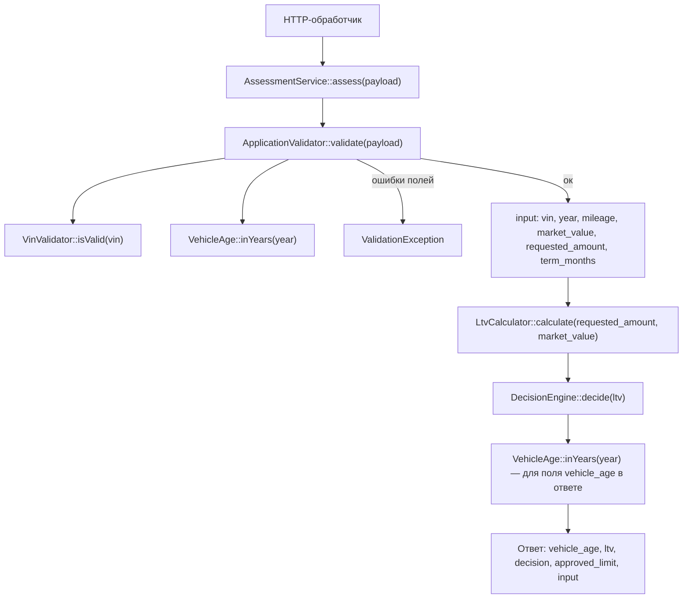

## Как считается решение

### Участники

| Файл | Роль |
|---|---|
| `backend/src/Domain/AssessmentService.php` | Точка входа: собирает шаги оценки в один пайплайн. |
| `backend/src/Domain/ApplicationValidator.php` | Валидирует и нормализует входные поля по `rules.php`. |
| `backend/src/Domain/VinValidator.php` | Проверяет формат VIN (длина 17, алфавит, нет I/O/Q). |
| `backend/src/Domain/VehicleAge.php` | Считает возраст авто в годах (текущий год − год выпуска). |
| `backend/src/Domain/LtvCalculator.php` | Считает LTV = `requested_amount / market_value * 100` (округление до 2 знаков). |
| `backend/src/Domain/DecisionEngine.php` | Пороговая логика approve / review / reject. |
| `backend/src/Domain/ValidationException.php` | Тип ошибки валидации с массивом `поле => сообщение`. |
| `backend/config/rules.php` | Справочник порогов и лимитов. |

### Порядок вызовов (точка входа — `AssessmentService::assess`)



Пошагово:

1. `AssessmentService::assess($payload)` (строка 28) — оркестратор.
2. `$this->validator->validate($payload)` (строка 30) — нормализует VIN (upper + trim) и приводит числа к `int`. Проверяет по `rules.php`:
    - VIN через `VinValidator::isValid`;
    - год: `vehicle.min_year`, `vehicle.max_age_years`, и запрет будущего (`VehicleAge::inYears($year) < 0`);
    - пробег: `0 ≤ mileage ≤ vehicle.max_mileage_km`;
    - `market_value > 0`;
    - `requested_amount` в `[amount.min, amount.max]`;
    - `term_months` в `[term.min_months, term.max_months]`.
      При любой ошибке — `throw new ValidationException($errors)`. При успехе возвращает нормализованный массив полей.
3. `$this->ltvCalculator->calculate($input['requested_amount'], $input['market_value'])` (строка 32) — возвращает LTV в процентах. Кидает `InvalidArgumentException`, если `market_value <= 0` или `requested_amount <= 0` (на практике эти ветки в текущем коде не достигаются, т.к. валидатор их уже отсекает).
4. `$this->decisionEngine->decide($ltv)` (строка 33) — единственное место, где появляются `approve` / `review` / `reject`. Логика в `DecisionEngine::decide`:
    - `ltv < approve_max` → `approve`;
    - `ltv <= review_max` → `review`;
    - иначе → `reject`.
      Текущие пороги из `rules.php`: `approve_max = 60.0`, `review_max = 85.0`.
5. `VehicleAge::inYears($input['year'])` (строка 36) — только чтобы положить `vehicle_age` в ответ, на решение не влияет.
6. `approved_limit` (строка 39): равен `requested_amount` при `approve`, иначе `0`. Справочник `rules.ltv_by_age` пока не используется (это задача LOAN-12, см. комментарий в шапке `AssessmentService` и в `rules.php`).

---

## Если добавить правило «пробег ≤ 400 000 км, иначе review»

### Где встанет

- В `AssessmentService::assess`, **между** `LtvCalculator::calculate(...)` и `DecisionEngine::decide(...)` (строки 32–33). Это единственное место, где решение «подавляется» до финального `decide(...)` по LTV. Альтернативно можно править `DecisionEngine::decide`, но он сейчас чисто пороговый и не принимает других параметров — расширять его не нужно.
- Порог `400 000` кладётся в `backend/config/rules.php`, в блок `vehicle` рядом с уже существующим `max_mileage_km` (например, `'max_mileage_review_km' => 400000`). Сейчас `max_mileage_km = 500000` — это **жёсткий потолок** в валидаторе, новое правило с ним не конфликтует.
- Никаких новых зависимостей у `AssessmentService` не потребуется: значение пробега уже есть в `$input['mileage']` после шага валидации.

### Входные данные: что есть, чего не хватает

Есть в коде сейчас:
- `$input['mileage']` — нормализованный целочисленный пробег, уже приведённый к `int` в `ApplicationValidator::validate` (строки 43 и 78).
- Нужный порог — добавить в `rules.php`.

Не хватает:
- Ничего. Источник пробега (поле `mileage` в payload) уже валидируется, нормализуется и проходит до `assess()`; больше ничего для этого правила не требуется.

### Как встроить (набросок, без правки)

```php
$ltv = $this->ltvCalculator->calculate(...);
$decision = $this->decisionEngine->decide($ltv);

// новое правило
if ($decision === DecisionEngine::APPROVE
    && $input['mileage'] > $this->rules['vehicle']['max_mileage_review_km']) {
    $decision = DecisionEngine::REVIEW;
}
```

(В текущей сигнатуре `AssessmentService` массив `$rules` не прокинут — добавить в конструктор как `private readonly array $rules`, чтобы не лазить в config из домена.)

---

## Что в коде уже сейчас проверяется про пробег

Только одно — в `ApplicationValidator::validate`, строки 43–46:

```php
$mileage = (int) ($payload['mileage'] ?? -1);
if ($mileage < 0 || $mileage > $this->rules['vehicle']['max_mileage_km']) {
    $errors['mileage'] = sprintf('Пробег от 0 до %d км', $this->rules['vehicle']['max_mileage_km']);
}
```

Это жёсткий диапазон `[0, 500000]`. При выходе — `ValidationException` (заявка отклоняется целиком, до `LtvCalculator`/`DecisionEngine` дело не доходит). На итоговое `approve/review/reject` пробег сейчас **никак не влияет** — ни в `AssessmentService`, ни в `DecisionEngine`, ни в `LtvCalculator` он не читается.

Поля `mileage` в БД/репозитории/справочнике `ltv_by_age` — нет.