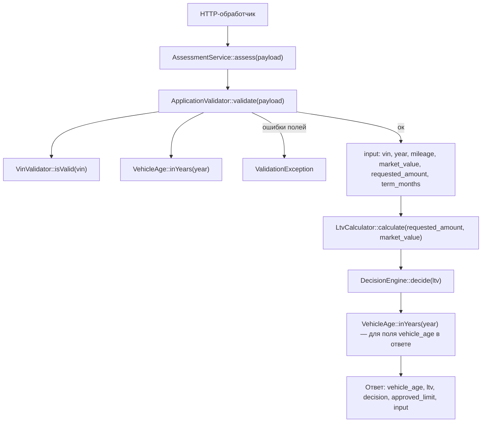

## Как считается решение

### Участники

| Файл | Роль |
|---|---|
| `backend/src/Domain/AssessmentService.php` | Точка входа: собирает шаги оценки в один пайплайн. |
| `backend/src/Domain/ApplicationValidator.php` | Валидирует и нормализует входные поля по `rules.php`. |
| `backend/src/Domain/VinValidator.php` | Проверяет формат VIN (длина 17, алфавит, нет I/O/Q). |
| `backend/src/Domain/VehicleAge.php` | Считает возраст авто в годах (текущий год − год выпуска). |
| `backend/src/Domain/LtvCalculator.php` | Считает LTV = `requested_amount / market_value * 100` (округление до 2 знаков). |
| `backend/src/Domain/DecisionEngine.php` | Пороговая логика approve / review / reject. |
| `backend/src/Domain/ValidationException.php` | Тип ошибки валидации с массивом `поле => сообщение`. |
| `backend/config/rules.php` | Справочник порогов и лимитов. |

### Порядок вызовов (точка входа — `AssessmentService::assess`)

```mermaid
flowchart TD
    A[HTTP-обработчик] --> B["AssessmentService::assess(payload)"]
    B --> C["ApplicationValidator::validate(payload)"]
    C --> C1["VinValidator::isValid(vin)"]
    C --> C2["VehicleAge::inYears(year)"]
    C -- "ошибки полей" --> X[ValidationException]
    C -- "ок" --> D[input: vin, year, mileage, market_value, requested_amount, term_months]
    D --> E["LtvCalculator::calculate(requested_amount, market_value)"]
    E --> F["DecisionEngine::decide(ltv)"]
    F --> G["VehicleAge::inYears(year) — для поля vehicle_age в ответе"]
    G --> H[Ответ: vehicle_age, ltv, decision, approved_limit, input]
```

Пошагово:

1. `AssessmentService::assess($payload)` (строка 28) — оркестратор.
2. `$this->validator->validate($payload)` (строка 30) — нормализует VIN (upper + trim) и приводит числа к `int`. Проверяет по `rules.php`:
    - VIN через `VinValidator::isValid`;
    - год: `vehicle.min_year`, `vehicle.max_age_years`, и запрет будущего (`VehicleAge::inYears($year) < 0`);
    - пробег: `0 ≤ mileage ≤ vehicle.max_mileage_km`;
    - `market_value > 0`;
    - `requested_amount` в `[amount.min, amount.max]`;
    - `term_months` в `[term.min_months, term.max_months]`.
      При любой ошибке — `throw new ValidationException($errors)`. При успехе возвращает нормализованный массив полей.
3. `$this->ltvCalculator->calculate($input['requested_amount'], $input['market_value'])` (строка 32) — возвращает LTV в процентах. Кидает `InvalidArgumentException`, если `market_value <= 0` или `requested_amount <= 0` (на практике эти ветки в текущем коде не достигаются, т.к. валидатор их уже отсекает).
4. `$this->decisionEngine->decide($ltv)` (строка 33) — единственное место, где появляются `approve` / `review` / `reject`. Логика в `DecisionEngine::decide`:
    - `ltv < approve_max` → `approve`;
    - `ltv <= review_max` → `review`;
    - иначе → `reject`.
      Текущие пороги из `rules.php`: `approve_max = 60.0`, `review_max = 85.0`.
5. `VehicleAge::inYears($input['year'])` (строка 36) — только чтобы положить `vehicle_age` в ответ, на решение не влияет.
6. **Правило по пробегу** (после `decide()`, до формирования `approved_limit`): если решение — `approve` и `$input['mileage'] > rules.vehicle.max_mileage_review_km` (400 000), решение понижается до `review`. Граница включительная: `mileage <= 400000` — ещё `approve`. Решения `review`/`reject` по LTV правило не трогает. Задача MILEAGE.
7. `approved_limit` (строка 39): равен `requested_amount` при `approve`, иначе `0`. Справочник `rules.ltv_by_age` пока не используется (это задача LOAN-12, см. комментарий в шапке `AssessmentService` и в `rules.php`).

---

## Правило «пробег ≤ 400 000 км, иначе review» (задача MILEAGE, реализовано)

### Где стоит

- В `AssessmentService::assess`, **после** `DecisionEngine::decide(...)` (строки 33–34) и **до** формирования массива ответа (строка 35 и далее). Правило подавляет `approve` до финального шага, чтобы `approved_limit` (строка 39) автоматически обнулился через условие `approve ? requested_amount : 0`.
- `DecisionEngine::decide` оставлен чисто пороговым по LTV и в задачу MILEAGE не расширяется.
- Порог `400 000` лежит в `backend/config/rules.php`, блок `vehicle`, ключ `max_mileage_review_km` рядом с уже существующим `max_mileage_km = 500000`. Связка `max_mileage_review_km <= max_mileage_km` закреплена тестом `testReviewThresholdDoesNotExceedHardCeiling`.
- В `AssessmentService` прокинут массив `$rules` (5-й параметр конструктора), чтобы домен не лазил в config сам.

### Шкала решений по пробегу (синхронно со спекой `spec_MILEAGE.md`)

| Пробег, км | Что происходит | Где |
|---|---|---|
| `0..400000` | решение по LTV, без влияния пробега | (правило не срабатывает) |
| `400001..500000` | `approve` по LTV понижается до `review`; `review`/`reject` по LTV не меняются; `approved_limit = 0` | `AssessmentService::assess` |
| `> 500000` | `ValidationException` по полю `mileage` (HTTP 422), до расчёта решения не доходит | `ApplicationValidator::validate` |

Жёсткий потолок `max_mileage_km` (500 000) в валидаторе не сдвинут и не заменён новым правилом — это разные механизмы: мягкое понижение в `AssessmentService` и жёсткий отказ в `ApplicationValidator`.

### Покрытие

Тесты: `tests/Unit/AssessmentServiceTest.php` (11 методов) и `tests/Unit/ApplicationValidatorTest.php` (4 метода) — по одному методу на каждый критерий приёмки AC-MILEAGE-01…16, кроме AC-MILEAGE-11 (по решению заказчика поведение `'' → 0 км` не закрепляется юнит-тестом, проверяется smoke).

---

## Что в коде проверяется про пробег сейчас

Два места:

1. **`ApplicationValidator::validate`, строки 43–46** — жёсткий диапазон `0..max_mileage_km` (500 000). При выходе — `ValidationException` (заявка отклоняется целиком, до `LtvCalculator`/`DecisionEngine` дело не доходит).
2. **`AssessmentService::assess`, строки 34–36** — мягкое правило задачи MILEAGE: `approve` при `mileage > max_mileage_review_km` (400 000) понижается до `review`.

Поля `mileage` в БД/репозитории/справочнике `ltv_by_age` — нет.